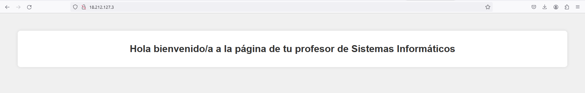

# Ejercicio

Sustituye la página index.html, que se encuentra en el directorio: /var/www/html, por un documento parecido a este y que muestre vuestro nombre y apellidos completos.

La captura debería ser algo como esto.

Ten en cuenta, que debe de contener la ***IP pública*** que se vee en la barra de direcciones, además de tu nombre y apellidos completos.