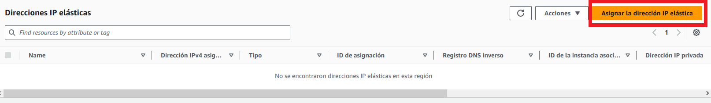
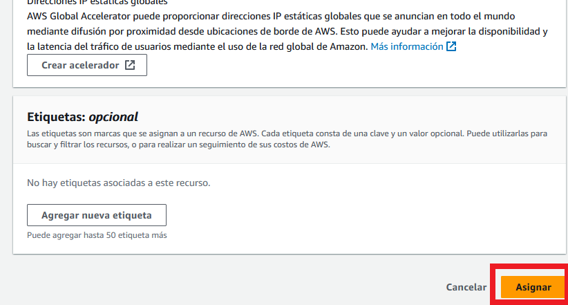
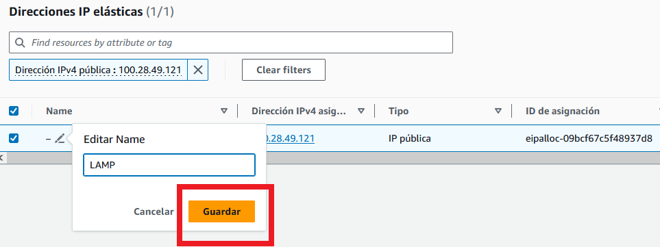
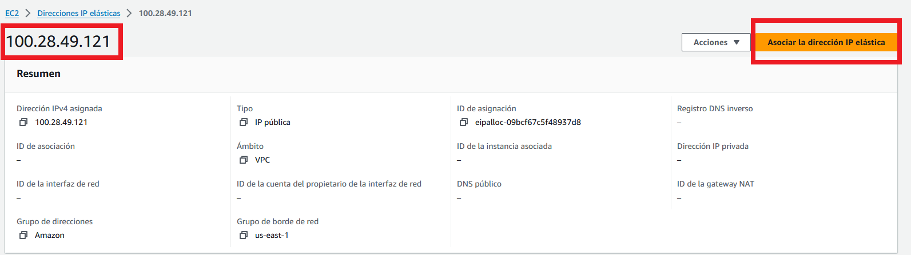
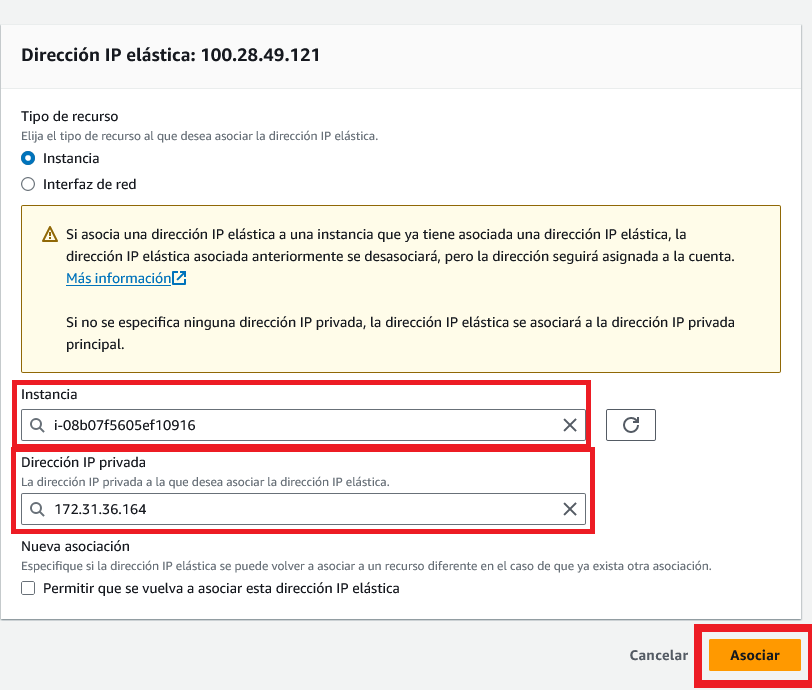
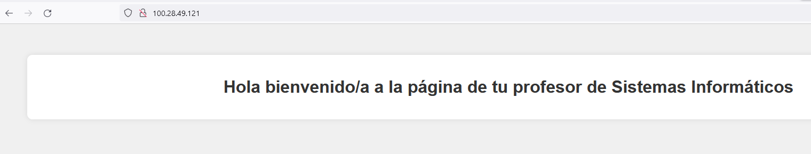

# Ip Elástica

## ¿Qué és la Ip elástica? 
Una de las ventajas de utilizar Amazon Elastic Compute Cloud (EC2) es la posibilidad de iniciar, detener, crear y terminar instancias en cualquier momento. No obstante, esta flexibilidad conlleva un potencial problema con las direcciones IP. Reiniciar una instancia detenida (o volver a crear una instancia después de que otra haya terminado) da como resultado una nueva dirección IP. ¿Cómo referenciar correctamente una máquina si la dirección IP cambia continuamente?

Como respuesta a este problema, Amazon ofrece la posibilidad de asignar una dirección IP elástica. Una IP elástica proporciona una dirección IP única que podrá asociar a diferentes instancias de EC2 en el transcurso del tiempo. Si la instancia de EC2 tiene una IP elástica y en algún momento dicha instancia es detenida o terminada, podrá asociar inmediatamente una nueva instancia de EC2 con la IP elástica. Las aplicaciones existentes no se desconectarán porque ven la dirección IP que esperan, aunque en el otro extremo la instancia de EC2 haya cambiado.

## Configurar IP elástica

En el panel izquierdo de `EC2`, en el apartado `Red y seguridad` tenemos la opción `Direcciones IP elácticas`.

### Pasos
1. Hay que asignar la dirección IP elástica.

2. Ir hasta el final y pulsar el botón de `Asignar`.

3. Una vez en el panel, hay que darle un nombre a nuestra nueva IP, por ejemplo `LAMP`.

4. Entramos dentro de la instancia para asignar esta IP a nuestra instancia.

5. Tenemos que seleccionar la instancia a la que queremos asociar la IP elástica y seleccionar la IP privada de dicha instancia (sale por defecto).

5. Una vez asociada, a partir ahora nuestra instacia siempre tendrá asociada en este caso la IP `100.28.49.121` y si la ponemos en el navegador, debería funcionar nuestro servidor web u otro servidio que tengamos en nuestra máquina.

> IMPORTANTE: Ten en cuenta que la IP elástica ***consume mucho saldo*** de nuestra cuenta.