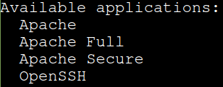
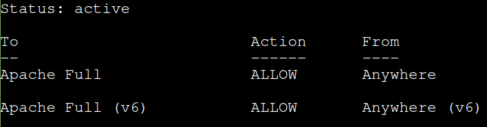
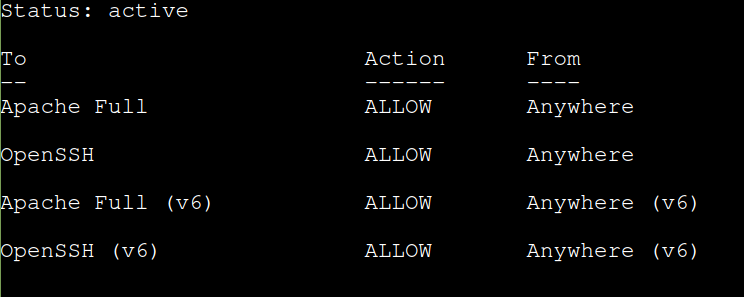
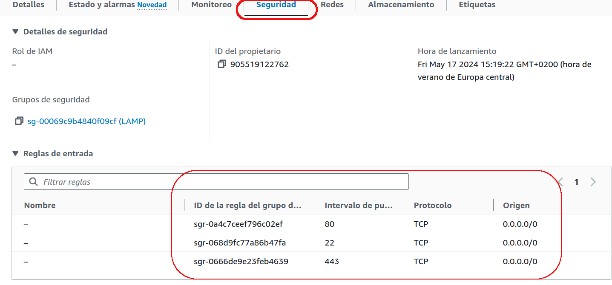
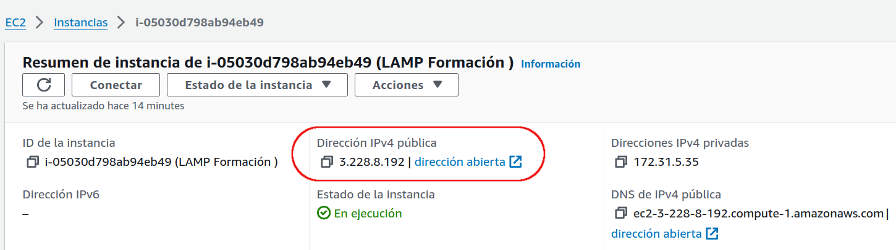
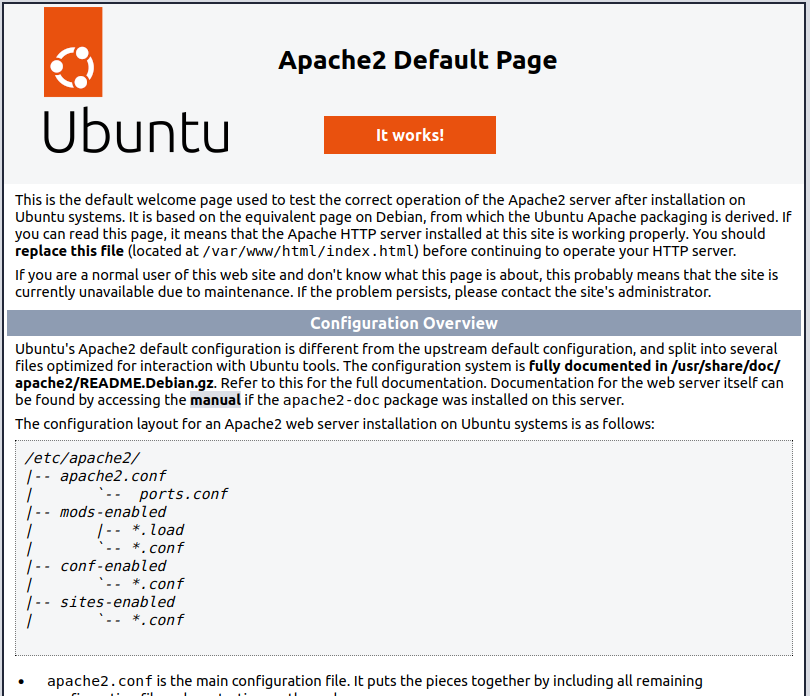
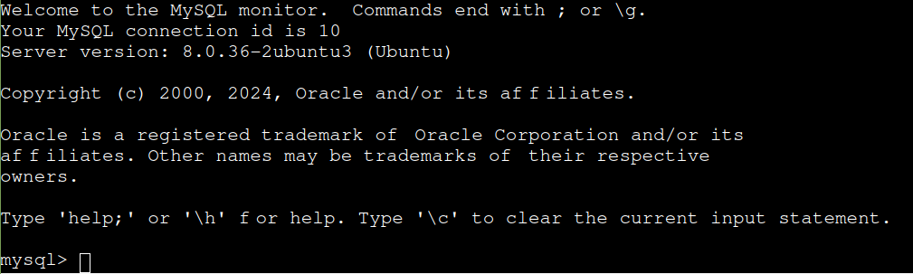
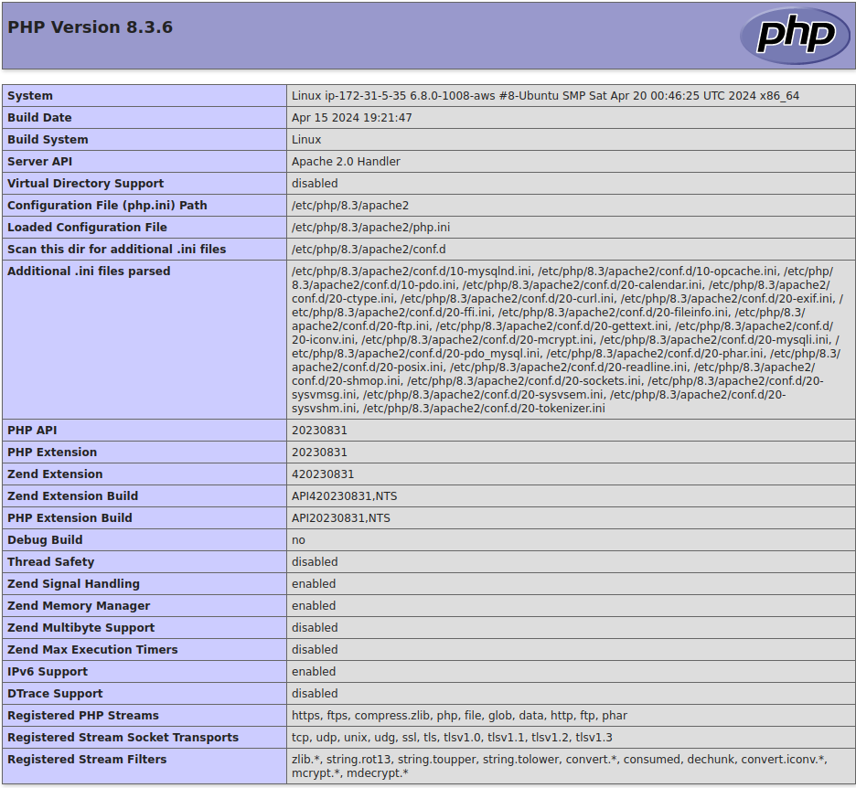

# Cómo instalar la pila Linux, Apache, MySQL y PHP (LAMP) en Ubuntu
### Introducción
Una pila “LAMP” es un conjunto de aplicaciones de software de código abierto que se suelen instalar juntas para que un servidor pueda alojar aplicaciones y sitios web dinámicos escritos en PHP. Este término es en realidad un acrónimo que representa al sistema operativo Linux, con el servidor web Apache. Los datos del sitio se almacenan en una base de datos MySQL y el contenido dinámico se procesa mediante PHP.

En esta guía, instalaremos una pila LAMP en un servidor Ubuntu 20.04 o superior.

## Paso 1: Instalar Apache y actualizar el firewall

El servidor web Apache está entre los más populares del mundo. Está bien documentado, tiene una comunidad de usuarios activa y ha sido muy utilizado durante gran parte de la historia de la web, por lo que es una excelente opción predeterminada para alojar sitios web.

Instale Apache usando el administrador de paquetes de Ubuntu, apt:

```sh
sudo apt update
sudo apt upgrade
sudo apt install apache2
```

Si es la primera vez que utiliza sudo en esta sesión, se le pedirá que proporcione su contraseña de usuario para confirmar que tenga los privilegios adecuados para administrar los paquetes del sistema con apt.  También se le solicitará que confirme la instalación de Apache al pulsar `Y` y `ENTER`.

Una vez que la instalación se complete, deberá ajustar la configuración de su firewall para permitir tráfico HTTP y HTTPS. UFW tiene diferentes perfiles de aplicaciones que puede aprovechar para hacerlo. Para enumerar todos los perfiles de aplicaciones de UFW disponibles, puede ejecutar lo siguiente:
```sh
sudo ufw app list
```

Verá un resultado como este:



A continuación, explicamos cada uno de estos perfiles:

   - Apache: este perfil abre solo el puerto `80` (tráfico web normal no cifrado).
   - Apache Full: este perfil abre los puertos `80` (tráfico web normal no cifrado) y `443` (tráfico TLS/SSL cifrado).
   - Apache Secure: este perfil abre solo el puerto `443` (tráfico TLS/SSL cifrado).

Por ahora, es mejor permitir conexiones únicamente en el puerto `80`, ya que se trata de una instalación nueva de Apache y todavía no tiene un certificado TLS/SSL configurado para permitir tráfico HTTPS en su servidor.

Para permitir tráfico únicamente en el puerto `80` utilice el perfil `Apache`, pero si queremos usar tanto el puerto `80` como el puerto `443` es necesario usar el perfil `Apache Full`, ten en cuenta que tambien se puede sustituir por  `http (80)` o por `https (443)`, en nuestro caso vamos a utilizar `Apache Full`:

```sh
sudo ufw allow "Apache Full"
```

Puede verificar el cambio con el siguiente comando:
```sh
sudo ufw status
```
Si nos sale que el error: `Status: inactive`

Eso significa que hay que activar **ufw**.

Para activar **ufw**, vamos a ejecutar el siguiente comando:
```sh
sudo ufw enable
```
Nos indicará que va a eliminar (disrupt) el puerto `ssh`.

Vamos a confirmar con `y`.

Al ejecutar de nuevo el comando:
```sh 
sudo ufw status
```
Ahora si vemos cual es el estado.


Para que en el futuro no tengamos problemas con el acceso remoto al equipo vamos a activar el puerto `22 (Open SSH)`, para ello vamos a ejecutar los siguientes comandos y luego veremos el estado.
```sh
sudo ufw allow openssh
```
La salida ahora sería:nu


Ahora, se permite tráfico en el puerto `80` a través del firewall.

Puede realizar una verificación rápida para comprobar que todo se haya realizado según lo previsto dirigiéndose a la dirección IP pública de su servidor en su navegador web (consulte la nota de la siguiente sección para saber cuál es su dirección IP pública si no dispone de esta información):
```sh
http://your_server_ip
```

Para ello vamos a ir a AWS y comprobar por una parte la configuración de seguridad de las reglas de entrada y por otra parte ver nuetra **IP pública**.

## Revisar configuración en AWS
Las reglas de configuración de seguridad de entrada, deben de ser la siguientes:
#### Reglas de seguridad de entrada

### Ip pública


En este caso la ip pública es: **3.228.8.192**, con lo que si ejecutamos en el navegador de nuestro PC lo siguiente:
```sh
http://3.228.8.192
```
Nos debe aparecer la página inicial de nuestro servidor.



## Paso 2: Instalar MySQL
Ahora que dispone de un servidor web funcional, deberá instalar un sistema de base de datos para poder almacenar y gestionar los datos de su sitio. MySQL es un sistema de administración de bases de datos popular que se utiliza en entornos PHP.

Una vez más, utilice `apt` para adquirir e instalar este software:

```sh
sudo apt install mysql-server
```
Cuando se le solicite, confirme la instalación al escribir `Y` y, luego, `ENTER`.

Cuando la instalación se complete, se recomienda ejecutar una secuencia de comandos de seguridad que viene preinstalada en MySQL Con esta secuencia de comandos se eliminarán algunos ajustes predeterminados poco seguros y se bloqueará el acceso a su sistema de base de datos. Inicie la secuencia de comandos interactiva ejecutando lo siguiente:
```sh
sudo mysql_secure_installation
```
Se le preguntará si desea configurar el `VALIDATE PASSWORD PLUGIN`.

Elije `Y` para indicar que sí, o cualquier otra cosa para continuar sin la habilitación.

Si responde “sí”, se le solicitará que seleccione un nivel de validación de contraseña. Tenga en cuenta que, si ingresa `2` para indicar el nivel más seguro, recibirá mensajes de error al intentar establecer cualquier contraseña que no contenga números, letras en mayúscula y minúscula, y caracteres especiales, o que se base en palabras comunes del diccionario.

Para el resto de las preguntas, presione `Y` y `ENTER` en cada mensaje. Con esto, se eliminarán algunos usuarios anónimos y la base de datos de prueba, se deshabilitarán las credenciales de inicio de sesión remoto de root y se cargarán estas nuevas reglas para que MySQL aplique de inmediato los cambios que realizó.

Cuando termine, compruebe si puede iniciar sesión en la consola de MySQL al escribir lo siguiente:
```sh
sudo mysql
```
Esto permitirá establecer conexión con el servidor de MySQL como root user de la base de datos administrativa, lo que se infiere del uso de sudo cuando se ejecuta este comando. Debería ver el siguiente resultado:



Para salir escribir:
```sh
mysql> exit;
```
## Paso 3: Instalar PHP

Instaló Apache para presentar su contenido y MySQL para almacenar y gestionar sus datos. PHP es el componente de nuestra configuración que procesará el código para mostrar contenido dinámico al usuario final. Además del paquete php, necesitará php-mysql, un módulo PHP que permite que este se comunique con bases de datos basadas en MySQL. También necesitará libapache2-mod-php para habilitar Apache para gestionar archivos PHP. Los paquetes PHP básicos se instalarán automáticamente como dependencias.

Para instalar estos paquetes, ejecute lo siguiente:
```sh
sudo apt install php libapache2-mod-php php-mysql php-mcrypt php-cgi php-curl php-json
```

Una vez que la instalación se complete, podrá ejecutar el siguiente comando para confirmar su versión de PHP:
```sh
php -v
```


En este punto, su pila LAMP está plenamente operativa, pero, para poder probar su configuración con una secuencia de comandos PHP, lo mejor es instalar un host virtual de Apache adecuado para almacenar los archivos y las carpetas de su sitio web. Lo haremos en el siguiente paso.


### 3.1 – Comprobación de la instalación de PHP

Ahora que has instalado PHP, vamos a comprobar si funciona correctamente creando un archivo de prueba y abriéndolo en el navegador.
Ahora, ingrese el siguiente comando.
```sh
sudo nano /var/www/html/test.php
```

Este comando abrirá nano editor con un archivo en blanco test.php para su edición. El directorio /var/www/html.

Aquí es donde Apache busca el archivo solicitado en la URL del sitio web de forma predeterminada si no se ha configurado para buscar otro sitio. Consulta la página de documentación de Apache Ubuntu para obtener información sobre su configuración.

Además, necesita privilegios de root para poder escribir en este directorio. Hemos utilizado `sudo` antes de nuestro comando. Ahora ingrese el siguiente texto en el editor abierto:
```sh
<?php
phpinfo();
?>
```
Después de ingresar este texto presione Ctrl + X (o CMD + X si está en Mac), y luego Y, y luego presione ENTER. Esto guardará el archivo y saldrá del editor. Ahora abra la siguiente dirección web en su navegador
```sh
http://<your_vps_ip_adress>/test.php
```

En nuestro caso:
```sh
http://3.228.8.192/test.php
```
El resultado debe ser algo parecido a esta imagen y eso significa que Apache puede procesar ficheros PHP.




## Paso 4: Cómo instalar PhpMyAdmin

Procederemos a la instalación de PhpMyAdmin. Se trata de una aplicación web que nos permitirá gestionar nuestras bases de datos directamente desde el navegador, algo que resulta práctico y cómodo.

La instalación de PhpMyAdmin es, posiblemente, el paso más complejo de todo el manual, ya que requiere de la intervención del usuario. Por favor, lee atentamente los pasos que detallaremos a continuación:
#### 1. Inicia la instalación
```sh
apt-get install phpmyadmin
```
#### 2. Crear contraseña para el usurio root y poder acceder a la BD des phpmyadmin

Primero de todo debemos de entrar en la base de datos con el usuario `root`
```sh
sudo mysql -u root
```
A continuación cambiamos la contraseña a `P@ssw0rd`, con el siguiente comando:
```sh
ALTER USER 'root'@'localhost' IDENTIFIED WITH mysql_native_password BY '1234';
```


