# EC2
## ¿Qué es Amazon Elastic Compute Cloud (Amazon EC2)?

Amazon EC2 es un servicio web que proporciona capacidad de computación en la nube y de tamaño modificable. Está diseñado para facilitar a los desarrolladores recursos de computación escalables basados en web.

Amazon Elastic Compute Cloud (Amazon EC2) ofrece la plataforma de computación más amplia y completa, con más de 750 instancias y la posibilidad de elegir el procesador, almacenamiento, redes, sistema operativo y modelo de compra más reciente, en función de lo que mejor se ajuste a las necesidades que plantea su carga de trabajo. Somos el primer proveedor de servicios en la nube destacado que admite procesadores Intel, AMD y ARM, la única nube con instancias Mac de EC2 bajo demanda y la única nube con redes Ethernet de 400 Gbps. Ofrecemos el mejor rendimiento por precio para la formación con machine learning, así como el menor costo por instancias de inferencia en la nube. Se ejecutan más cargas de trabajo de SAP, computación de alto rendimiento (HPC), ML y Windows en AWS que en cualquier otra nube. 

## Pasos
### 1.- Acceso
Primero de todo vamos al panel EC2 de nuestra cuenta.
Podemos acceder a nuestras **maquinas virtuales** por cualquiera de las dos opciones resaltadas en la imágen.

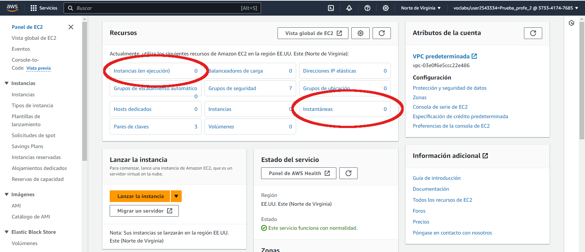

Una vez dentro nos sale el panel con las máquina virtuales que tengamos y su estado. En este caso está vacio.

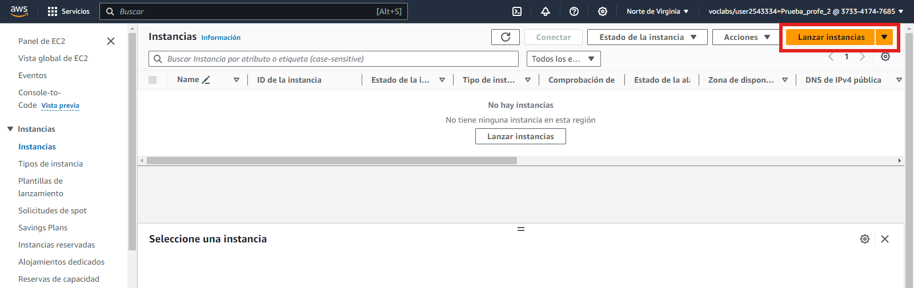

Para empezar nos vamos al botón ***Lanzar instancias***. Que podemos encontrar en la esquina superior derecha.

Para mostrarnos el panel para la creación de maquinas virtuales.
### 2.- Elección de sistema operativo.
En la ventana para elegir el sistems operativo, primero de todo, hay que darle un nombre a nuestra máquina, no es obligatorio, pero sí recomendable si vamos a tener más de una máquina virtual en nuestras instancias, para distinguirlas.
En nuestro caso vamos a seleccionar una máquina tipo `Ubuntu Server` y le vamos a poner de nombre `Linux` (nombre original).

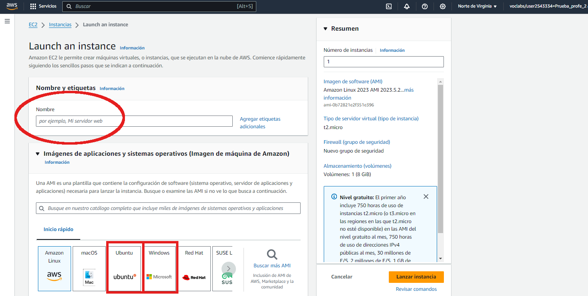

### 3.- Tipos de instancia
Una vez seleccionado el sistema operativo, nos toca elegir el tipo de instancias. Es decir, el `hardware` de la máquina, en este caso incluya memoria RAM y CPU. Hay que tener en cuenta que no se puede usar cualquier tipo de instancia, sólo la que nos permite nuestra capa gratuita. 
Como **recomendación** sugiero utilizar una instancia de tipo: `t3.` + micro, small, medium, large, ....

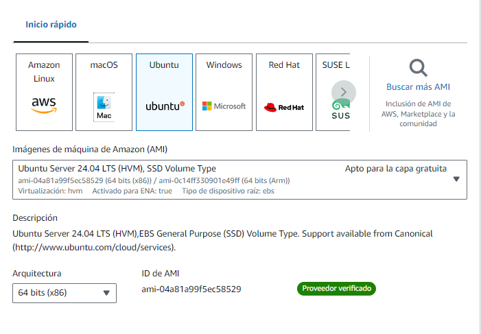

En nuestro caso y para una instancia de `Ubuntu Server` con una instancia de tipo `t3.micro / t3.small` es suficiente, sin embargo para una máquina `Windows Server`, recomiendo una instancia de tipo `t3.medium / t3.large`.

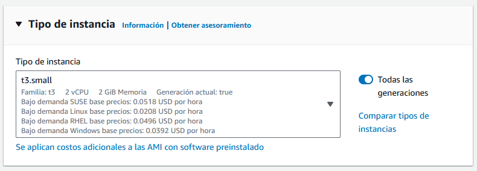

### 4.- Par de claves

Ahora nos toca seleccionar un par de claves para cifrar la información.
Un par de claves, que consta de una clave pública y una clave privada, es un conjunto de credenciales de seguridad que se utiliza para demostrar tu identidad cuando te conectas a una instancia de Amazon EC2. En el caso de las instancias de Linux, la clave privada te permite utilizar SSH para conectarte de forma segura a la instancia. Para las instancias de Windows, se requiere la clave privada para descifrar la contraseña del administrador, que después utilizarás para conectarte a la instancia.

**IMPORTANTE**
Se pueden crear una clave personalizada, pero debes de custiodarla muy bien, ya que si pierdes el fichero no podrás entrar a tus máquinas.
Por eso se recomienda utilizar el par de claves que ofrece Amazón por `defecto`. En este caso ***vockey***.

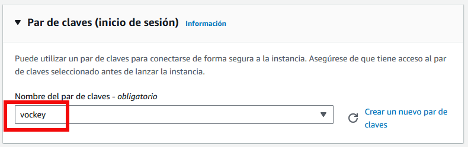

Para obtener el fichero `.pem` para este par de clave `vockey`, se obtiene de la ventana donde se inicia el laboratorio.

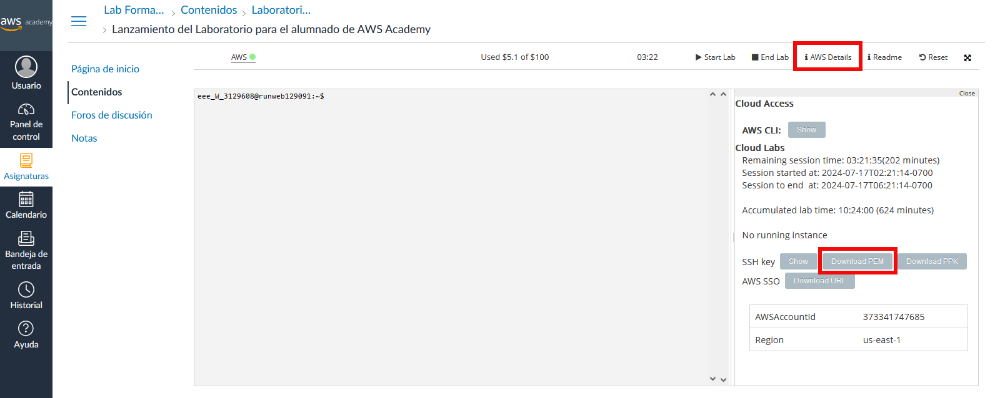

En el apartado `! Aws Details` aparece abajo la opción de `Download PEM`, que nos permite descargar nuestro fichero `.pem`, con nuestra clave privada. Lo **interesante** es que podemos volver a descargar este fichero desde cualquier ordenador y no hay problema que perdamos el fichero.

### 5.- Configuración de red
Esta es la parte más importante, ya que vamos a elegir la red en la que va a trabajar nuestras máquinas y también el `grupo de seguridad` para la apertura de puertos necesarios para acceder a nuestra máquina y aplicar la seguridad.

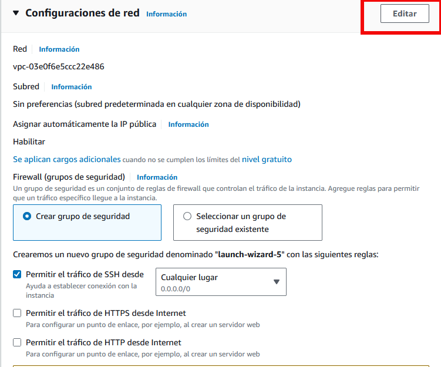

#### 1.- Seleccionar la VPC
Si tenemos otras VPC's a parte de la VPC por defecto que se genera la crear el laboratorio.

Cómo se puede ver en la imagen hay una VPC seleccionada, es la VPC por defecto que nos ha generado Amazón y es suficiente para trabajar, pero en nuestro caso, cómo hemos creado una VPC específica, vamos a aprovechar y usarla, para ello elegimos el botón `Editar` que está al principio del bloque a la derecha.

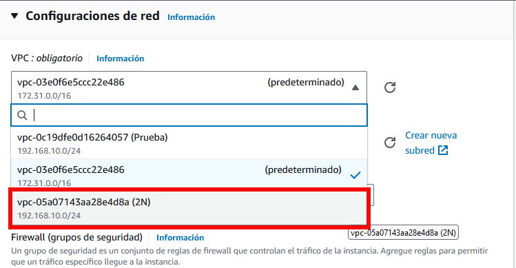

Aparecen como se puede ver todas las VPC's a aparte de la VPC prederteminada.

En nuestro caso seleccionamos la que hemos creado con la etiqueta `2N`.

#### 2.- Seleccionar la subred
Al seleccionar nuestra VPC hay que seleccionar la `subred` dentro de la cual va a estar nuestra máquina.

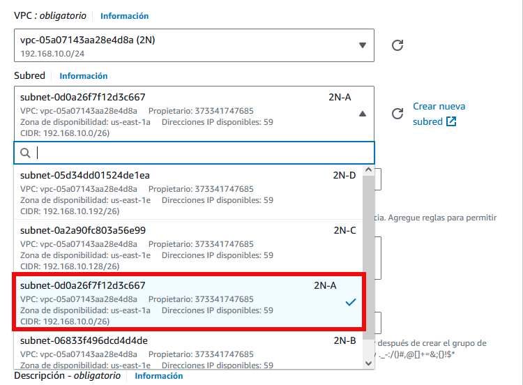

Dentro de la lista de `subredes` que hemos creado en otro paso, seleccionamos la que queremos. En nuestro caso vamos a seleccionar la subred `2N-A`, pero cada uno eligirá la que crea conveniente según su caso.

#### 3.- IP pública
Es importante **Habilitar** la asignación de una IP pública, para poder acceder a la máquina desde el exterior, si no habilitais esta opción no se podrá acceder a la máquina desde el exterior.
Si lo dejamos en **Desactivar**, sólo podremos acceder a la máquina a través de otra máquina que sí tengas acceso al exterior, puede ser una medida de seguridad y una opción a valorar.
Nosotros en nuestro caso dejamos la opción en `Habilitar`.

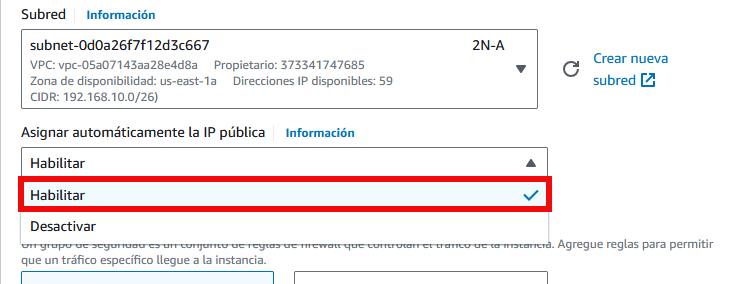

## Windows
## Linux